# Ladderlib
  
Ladderlib is a C library designed for implementing ladder logic programming, a method widely used in Programmable Logic Controllers (PLCs) for industrial automation. It provides a robust framework to define, execute, and manage ladder logic programs, supporting hardware interactions and custom function extensions. This library is particularly suited for embedded systems.  
  
**Project Information:**  
- **Repository:** [Ladderlib GitHub](https://github.com/hiperiondev/ladderlib)  
- **Version:** 2.0.0  
- **License:** MIT License  
- **Copyright:** 2025 Emiliano Gonzalez (egonzalez.hiperion@gmail.com)  
  
## Overview  
Ladderlib enables developers to create ladder logic programs, which are graphical representations of control logic resembling electrical relay circuits. These programs are executed cyclically by PLCs to automate industrial processes, such as controlling machinery in manufacturing or chemical processing. The library  supports defining logic through cells and networks, managing execution states, handling hardware inputs/outputs, and integrating custom functions for enhanced flexibility.  
  
Key features include:  
- **Instruction Set**: 39 instructions for defining logic operations.  
- **State Management**: 6 states to control program execution.  
- **Error Handling**: 8 error codes for robust operation.  
- **Hardware Integration**: Function pointers for reading inputs and writing outputs.  
- **Custom Extensions**: Support for adding user-defined functions.  
  
The library is likely optimized for embedded systems.
 
## Introduction to Ladder Logic  
Ladder logic programs consist of "rungs" connecting two vertical "rails," mimicking electrical relay circuits. Each rung contains conditions (e.g., contacts) and actions (e.g., coils)

## Basic Logic Instructions  

### Instruction Summary Table  
The following table summarizes the instructions, their codes, categories, and symbols.  
  
| Instruction | Code | Category | Symbol | Description |  
|-------------|------|----------|--------|-------------|  
| NOP | 0 | Specialized | None | No operation, placeholder |  
| CONN | 1 | Specialized | Vertical lines | Connects rungs or branches |  
| NEG | 2 | Specialized |  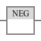 | Inverts logic state |  
| NO | 3 | Basic Logic | 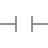 | Normally Open contact |  
| NC | 4 | Basic Logic |  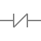 | Normally Closed contact |  
| RE | 5 | Specialized |  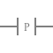 | Rising edge detection |  
| FE | 6 | Specialized |  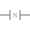 | Falling edge detection |  
| COIL | 7 | Basic Logic |  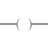 | Output coil |  
| COILL | 8 | Basic Logic |  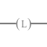 | Latched coil |  
| COILU | 9 | Basic Logic |  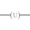 | Unlatched coil |  
| TON | 10 | Timer |  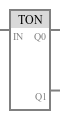 | Timer On Delay |  
| TOFF | 11 | Timer |  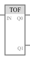 | Timer Off Delay |  
| TP | 12 | Timer |  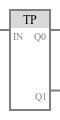 | Timer Pulse |  
| CTU | 13 | Counter |  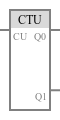 | Count Up |  
| CTD | 14 | Counter |  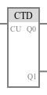 | Count Down |  
| MOVE | 15 | Specialized | 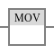 | Moves data |  
| SUB | 16 | Arithmetic |  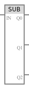 | Subtraction |  
| ADD | 17 | Arithmetic | 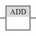 | Addition |  
| MUL | 18 | Arithmetic | 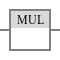 | Multiplication |  
| DIV | 19 | Arithmetic | 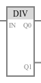| Division |  
| MOD | 20 | Arithmetic | 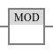 | Modulus |  
| SHL | 21 | Bitwise | 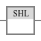 | Shift Left |  
| SHR | 22 | Bitwise |  | Shift Right |  
| ROL | 23 | Bitwise | 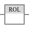 | Rotate Left |  
| ROR | 24 | Bitwise | 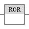 | Rotate Right |  
| AND | 25 | Bitwise | 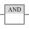 | Bitwise AND |  
| OR | 26 | Bitwise | 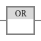 | Bitwise OR |  
| XOR | 27 | Bitwise | 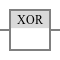 | Bitwise XOR |  
| NOT | 28 | Bitwise | 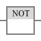 | Bitwise NOT |  
| EQ | 29 | Comparison | 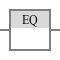 | Equal |  
| GT | 30 | Comparison | 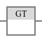 | Greater Than |  
| GE | 31 | Comparison | 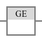 | Greater Than or Equal |  
| LT | 32 | Comparison | 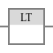 | Less Than |  
| LE | 33 | Comparison | 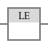 | Less Than or Equal |  
| NE | 34 | Comparison | 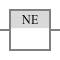 | Not Equal |  
| FOREIGN | 35 | Specialized | Box labeled "FOREIGN" | External function call |  
| TMOVE | 36 | Specialized | 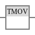 | Table data move |  
| INV | 37 | Specialized | None | Invalid instruction |

## Basic Instructions
Basic instructions manage Input/Output functions
  
### NO (Normally Open Contact)  
- **Instruction Code:** `LADDER_INS_NO` (3)  
- **Description:** The Normally Open contact allows logic flow when its associated input is true, acting like a switch that closes when activated. It is used to check if an input condition (e.g., a sensor) is met.  
- **Example Use:** Checking if a pushbutton is pressed to activate a motor.  
  
### NC (Normally Closed Contact)  
- **Instruction Code:** `LADDER_INS_NC` (4)  
- **Description:** The Normally Closed contact allows logic flow when its associated input is false, acting like a switch that opens when activated. It is used to proceed when a condition is not met.  
- **Example Use:** Ensuring a safety switch is not triggered before starting a process.  
  
### COIL (Output Coil)  
- **Instruction Code:** `LADDER_INS_COIL` (7)  
- **Description:** The Coil instruction sets an output to true when the rung's logic is true, controlling devices like motors or lights. It represents the action taken when conditions are satisfied.  
- **Example Use:** Turning on a conveyor belt when all conditions are met.  
  
### COILL (Coil Latch)  
- **Instruction Code:** `LADDER_INS_COILL` (8)  
- **Description:** The Coil Latch sets an output to true and maintains it (latches) even if the input conditions change, until unlatched. It is used for memory functions in control systems.  
- **Example Use:** Keeping a pump running after a start button is released.  
  
### COILU (Coil Unlatch)  
- **Instruction Code:** `LADDER_INS_COILU` (9)  
- **Description:** The Coil Unlatch resets a latched output to false, releasing the latched state. It is paired with `COILL` for set/reset operations.  
- **Example Use:** Stopping a latched pump when a stop button is pressed.  
  
## Timer Instructions  
Timer instructions manage time-based operations, delaying or pulsing outputs.  
  
### TON (Timer On Delay)  
- **Instruction Code:** `LADDER_INS_TON` (10)  
- **Description:** The Timer On Delay starts timing when its input is true. After a preset time, the output becomes true. It is used to delay actions, such as waiting before starting a motor.  
- **Example Use:** Delaying a fan activation for 10 seconds after a heater starts.  
  
### TOFF (Timer Off Delay)  
- **Instruction Code:** `LADDER_INS_TOFF` (11)  
- **Description:** The Timer Off Delay starts timing when its input goes false. After a preset time, the output becomes false. It is used to extend the duration of an output.  
- **Example Use:** Keeping a light on for 5 seconds after a switch is turned off.  
  
### TP (Timer Pulse)  
- **Instruction Code:** `LADDER_INS_TP` (12)  
- **Description:** The Timer Pulse generates a pulse of a specified duration when triggered by a true input. It is used for creating timed signals, such as a brief alarm.  
- **Example Use:** Activating a buzzer for 2 seconds when a fault is detected.  
  
## Counter Instructions  
Counter instructions track the number of events or occurrences.  
  
### CTU (Count Up)  
- **Instruction Code:** `LADDER_INS_CTU` (13)  
- **Description:** The Count Up counter increments its count each time the input transitions from false to true, up to a preset value. It is used to count items or events.  
- **Example Use:** Counting the number of boxes on a conveyor belt.  
  
### CTD (Count Down)  
- **Instruction Code:** `LADDER_INS_CTD` (14)  
- **Description:** The Count Down counter decrements its count each time the input transitions from false to true, down to zero. It is used for countdown tasks.  
- **Example Use:** Tracking remaining items in a batch process.  
  
## Arithmetic Instructions  
These instructions perform mathematical operations on data.  
  
### ADD (Addition)  
- **Instruction Code:** `LADDER_INS_ADD` (17)  
- **Description:** Adds two values and stores the result in a specified location. It is used for calculations like summing sensor readings.  
- **Example Use:** Adding the outputs of two flow sensors.  
  
### SUB (Subtraction)  
- **Instruction Code:** `LADDER_INS_SUB` (16)  
- **Description:** Subtracts one value from another and stores the result. It is used for differential calculations.  
- **Example Use:** Calculating the difference in pressure between two points.  
  
### MUL (Multiplication)  
- **Instruction Code:** `LADDER_INS_MUL` (18)  
- **Description:** Multiplies two values and stores the result. It is used for scaling or area calculations.  
- **Example Use:** Calculating power by multiplying voltage and current.  
  
### DIV (Division)  
- **Instruction Code:** `LADDER_INS_DIV` (19)  
- **Description:** Divides one value by another and stores the result. It is used for ratio calculations.  
- **Example Use:** Determining speed by dividing distance by time.  
  
### MOD (Modulus)  
- **Instruction Code:** `LADDER_INS_MOD` (20)  
- **Description:** Computes the remainder of dividing one value by another. It is used for cyclic operations or remainder checks.  
- **Example Use:** Checking if a counter value is even or odd.  
  
## Bitwise Operation Instructions  
These instructions manipulate bits within data values.  
  
### SHL (Shift Left)  
- **Instruction Code:** `LADDER_INS_SHL` (21)  
- **Description:** Shifts the bits of a value to the left by a specified number of positions, filling with zeros. It is used for bit manipulation or scaling.  
- **Example Use:** Doubling a binary value by shifting left.  
  
### SHR (Shift Right)  
- **Instruction Code:** `LADDER_INS_SHR` (22)  
- **Description:** Shifts the bits of a value to the right by a specified number of positions, filling with zeros or sign bits. It is used for division or bit extraction.  
- **Example Use:** Halving a binary value by shifting right.  
  
### ROL (Rotate Left)  
- **Instruction Code:** `LADDER_INS_ROL` (23)  
- **Description:** Rotates the bits of a value to the left, with the most significant bit wrapping around to the least significant position. It is used for circular shifts.  
- **Example Use:** Rotating status flags in a control word.  
  
### ROR (Rotate Right)  
- **Instruction Code:** `LADDER_INS_ROR` (24)  
- **Description:** Rotates the bits of a value to the right, with the least significant bit wrapping around to the most significant position. It is used for circular shifts.  
- **Example Use:** Cycling through a set of control bits.  
  
### AND (Bitwise AND)  
- **Instruction Code:** `LADDER_INS_AND` (25)  
- **Description:** Performs a bitwise AND operation on two values, setting output bits to 1 only where both inputs are 1. It is used for masking or condition checks.  
- **Example Use:** Masking specific bits in a status register.  
  
### OR (Bitwise OR)  
- **Instruction Code:** `LADDER_INS_OR` (26)  
- **Description:** Performs a bitwise OR operation on two values, setting output bits to 1 where either input is 1. It is used for combining conditions.  
- **Example Use:** Combining multiple fault flags.  
  
### XOR (Bitwise XOR)  
- **Instruction Code:** `LADDER_INS_XOR` (27)  
- **Description:** Performs a bitwise XOR operation on two values, setting output bits to 1 where inputs differ. It is used for toggling or comparison.  
- **Example Use:** Detecting changes in bit patterns.  
  
### NOT (Bitwise NOT)  
- **Instruction Code:** `LADDER_INS_NOT` (28)  
- **Description:** Performs a bitwise NOT operation, inverting all bits of a value. It is used for logical negation.  
- **Example Use:** Inverting a control signal.  
  
## Comparison Instructions  
These instructions compare values and produce boolean outputs.  
  
### EQ (Equal)  
- **Instruction Code:** `LADDER_INS_EQ` (29)  
- **Description:** Checks if two values are equal, outputting true if they are. It is used for equality checks in control logic.  
- **Example Use:** Verifying if a temperature reading matches a setpoint.  
  
### GT (Greater Than)  
- **Instruction Code:** `LADDER_INS_GT` (30)  
- **Description:** Checks if one value is greater than another, outputting true if so. It is used for threshold checks.  
- **Example Use:** Checking if pressure exceeds a safe limit.  
  
### GE (Greater Than or Equal)  
- **Instruction Code:** `LADDER_INS_GE` (31)  
- **Description:** Checks if one value is greater than or equal to another, outputting true if so. It is used for inclusive threshold checks.  
- **Example Use:** Ensuring a tank level is at or above a minimum.  
  
### LT (Less Than)  
- **Instruction Code:** `LADDER_INS_LT` (32)  
- **Description:** Checks if one value is less than another, outputting true if so. It is used for lower-bound checks.  
- **Example Use:** Detecting if a speed is below a target.  
  
### LE (Less Than or Equal)  
- **Instruction Code:** `LADDER_INS_LE` (33)  
- **Description:** Checks if one value is less than or equal to another, outputting true if so. It is used for inclusive lower-bound checks.  
- **Example Use:** Verifying a flow rate is at or below a maximum.  
  
### NE (Not Equal)  
- **Instruction Code:** `LADDER_INS_NE` (34)  
- **Description:** Checks if two values are not equal, outputting true if they differ. It is used for change detection.  
- **Example Use:** Detecting a change in a sensor value.  
  
## Specialized Instructions  
These instructions provide additional functionality, some of which may be specific to ladderlib.  
  
### NOP (No Operation)  
- **Instruction Code:** `LADDER_INS_NOP` (0)  
- **Description:** Performs no operation, acting as a placeholder or for timing purposes. It does not affect the program state.  
- **Example Use:** Reserving space for future instructions.  
  
### CONN (Connection)  
- **Instruction Code:** `LADDER_INS_CONN` (1)  
- **Description:** Likely used to connect different parts of the ladder diagram, such as branching or joining rungs. It facilitates complex logic structures.  
- **Example Use:** Linking parallel branches in a rung.  
  
### NEG (Negate)  
- **Instruction Code:** `LADDER_INS_NEG` (2)  
- **Description:** Inverts the logic state of an input, turning true to false or vice versa. It is used to reverse conditions.  
- **Example Use:** Inverting a stop signal to enable a process.  
  
### RE (Rising Edge)  
- **Instruction Code:** `LADDER_INS_RE` (5)  
- **Description:** Detects a rising edge, triggering when an input transitions from false to true. It is used for event-driven actions.  
- **Example Use:** Starting a counter when a button is pressed.  
  
### FE (Falling Edge)  
- **Instruction Code:** `LADDER_INS_FE` (6)  
- **Description:** Detects a falling edge, triggering when an input transitions from true to false. It is used for event-driven actions.  
- **Example Use:** Resetting a system when a sensor deactivates.  
  
### MOVE (Move Data)  
- **Instruction Code:** `LADDER_INS_MOVE` (15)  
- **Description:** Copies data from one memory location to another without modification. It is used for data transfer.  
- **Example Use:** Transferring a sensor value to a display register.  
  
### TMOVE (Table Move)  
- **Instruction Code:** `LADDER_INS_TMOVE` (36)  
- **Description:** Likely used for moving data within tables or arrays, possibly for batch processing or data manipulation. The exact functionality may depend a lot on ladderlib's implementation.  
- **Example Use:** Moving a set of values to a new memory block.  
  
### FOREIGN (Foreign Function)  
- **Instruction Code:** `LADDER_INS_FOREIGN` (35)  
- **Description:** Allows calling external or user-defined functions not natively supported by ladder logic. It enables integration with custom code.  
- **Example Use:** Calling a custom algorithm for complex calculations.  
  
### INV (Invalid)  
- **Instruction Code:** `LADDER_INS_INV` (37)  
- **Description:** Marks the beginning of invalid instruction codes, not intended for use in programs. It serves as a boundary for valid instructions.  
- **Example Use:** None, as it is not used in programming.  
  
### MULTI (Multi-cell Instruction)  
- **Instruction Code:** `LADDER_INS_MULTI` (255, 0xff)  
- **Description:** Indicates that the cell is part of a larger instruction spanning multiple cells, used for complex operations requiring additional data.  
- **Example Use:** Implementing a multi-step operation like a sequence control.

## API Documentation  
  
This section provides detailed documentation for the core API functions of LadderLib, extracted from the header files `ladder.h`, `ladder_instructions.h`, and `ladder_internals.h`.  
  
### ladder_init  
  
Initializes the ladder context with specified parameters for networks, memory, inputs, outputs, timers, counters, and blocks.  
  
```c  
ladder_ctx_t* ladder_init(uint32_t net_columns_qty, uint32_t net_rows_qty, uint32_t networks_qty, uint32_t qty_m, uint32_t qty_i, uint32_t qty_q, uint32_t qty_t, uint32_t qty_c, uint32_t qty_b)  
```  
  
**Parameters:**  
  
| **Parameter** | **Description** |  
|---------------|-----------------|  
| `net_columns_qty` | Number of columns in networks (max 32). Defines the width of each network grid. |  
| `net_rows_qty` | Number of rows in networks. Defines the height of each network grid. |  
| `networks_qty` | Number of networks. Specifies how many ladder networks the context will manage. |  
| `qty_m` | Quantity of memory bits. Number of general-purpose memory bits available. |  
| `qty_i` | Quantity of input bits. Number of input bits for interfacing with external inputs. |  
| `qty_q` | Quantity of output bits. Number of output bits for controlling external devices. |  
| `qty_t` | Quantity of timers. Number of timer instances available for timing operations. |  
| `qty_c` | Quantity of counters. Number of counter instances available for counting events. |  
| `qty_b` | Quantity of blocks. Number of functional blocks available for advanced operations. |  
  
**Returns**: Pointer to the initialized `ladder_ctx_t` structure, or `NULL` if initialization fails.  
  
### ladder_deinit  
  
Deinitializes the ladder context, freeing all associated resources.  
  
```c  
void ladder_deinit(ladder_ctx_t* ladder_ctx)  
```  
  
**Parameters:**  
  
| **Parameter** | **Description** |  
|---------------|-----------------|  
| `ladder_ctx` | Pointer to the ladder context to be deinitialized. |  
  
**Returns**: None.  
  
### ladder_add_network  
  
Adds a new network to the ladder context with a specified ID.  
  
```c  
ladder_network_t* ladder_add_network(ladder_ctx_t* ladder_ctx, uint32_t id)  
```  
  
**Parameters:**  
  
| **Parameter** | **Description** |  
|---------------|-----------------|  
| `ladder_ctx` | Pointer to the ladder context. |  
| `id` | Unique identifier for the network. |  
  
**Returns**: Pointer to the newly created `ladder_network_t` structure, or `NULL` if the operation fails.  
  
### ladder_execute  
  
Executes the ladder program, processing all networks and instructions.  
  
```c  
void ladder_execute(ladder_ctx_t* ladder_ctx)  
```  
  
**Parameters:**  
  
| **Parameter** | **Description** |  
|---------------|-----------------|  
| `ladder_ctx` | Pointer to the ladder context to execute. |  
  
**Returns**: None.  
  
### ladder_add_read_fn  
  
Registers a callback function for reading input values from hardware.  
  
```c  
void ladder_add_read_fn(ladder_ctx_t* ladder_ctx, _io_read read_fn)  
```  
  
**Parameters:**  
  
| **Parameter** | **Description** |  
|---------------|-----------------|  
| `ladder_ctx` | Pointer to the ladder context. |  
| `read_fn` | Pointer to the read callback function. |  
  
**Returns**: None.  
  
### ladder_add_write_fn  
  
Registers a callback function for writing output values to hardware.  
  
```c  
void ladder_add_write_fn(ladder_ctx_t* ladder_ctx, _io_write write_fn)  
```  
  
**Parameters:**  
  
| **Parameter** | **Description** |  
|---------------|-----------------|  
| `ladder_ctx` | Pointer to the ladder context. |  
| `write_fn` | Pointer to the write callback function. |  
  
**Returns**: None.  
  
### ladder_add_instruction  
  
Adds an instruction to a specific position in a network.  
  
```c  
bool ladder_add_instruction(ladder_network_t* network, uint32_t row, uint32_t column, ladder_instruction_e instruction, uint32_t id)  
```  
  
**Parameters:**  
  
| **Parameter** | **Description** |  
|---------------|-----------------|  
| `network` | Pointer to the network where the instruction will be added. |  
| `row` | Row index in the network grid (0-based). |  
| `column` | Column index in the network grid (0-based). |  
| `instruction` | Type of instruction (e.g., `LADDER_INSTRUCTION_LD`). See `ladder_instruction_e` enum. |  
| `id` | Identifier for the instruction operand (e.g., input, output, timer ID). |  
  
**Returns**: `true` if the instruction was added successfully, `false` otherwise.  
  
### ladder_add_init_fn  
  
Registers a callback function for initializing or deinitializing I/O operations.  
  
```c  
void ladder_add_init_fn(ladder_ctx_t* ladder_ctx, _io_init init_fn)  
```  
  
**Parameters:**  
  
| **Parameter** | **Description** |  
|---------------|-----------------|  
| `ladder_ctx` | Pointer to the ladder context. |  
| `init_fn` | Pointer to the init/deinit callback function. |  
  
**Returns**: None.  
  
### ladder_add_scan_end_fn  
  
Registers a callback function to be called at the end of each scan cycle.  
  
```c  
void ladder_add_scan_end_fn(ladder_ctx_t* ladder_ctx, _on_scan_end scan_end_fn)  
```  
  
**Parameters:**  
  
| **Parameter** | **Description** |  
|---------------|-----------------|  
| `ladder_ctx` | Pointer to the ladder context. |  
| `scan_end_fn` | Pointer to the scan end callback function. |  
  
**Returns**: None.  
  
### ladder_add_instruction_fn  
  
Registers a callback function to be called for each instruction execution.  
  
```c  
void ladder_add_instruction_fn(ladder_ctx_t* ladder_ctx, _on_instruction instruction_fn)  
```  
  
**Parameters:**  
  
| **Parameter** | **Description** |  
|---------------|-----------------|  
| `ladder_ctx` | Pointer to the ladder context. |  
| `instruction_fn` | Pointer to the instruction callback function. |  
  
**Returns**: None.  
  
### ladder_add_task_before_fn  
  
Registers a callback function to be called before each task cycle scan.  
  
```c  
void ladder_add_task_before_fn(ladder_ctx_t* ladder_ctx, _on_task_before task_before_fn)  
```  
  
**Parameters:**  
  
| **Parameter** | **Description** |  
|---------------|-----------------|  
| `ladder_ctx` | Pointer to the ladder context. |  
| `task_before_fn` | Pointer to the task before callback function. |  
  
**Returns**: None.  
  
### ladder_add_task_after_fn  
  
Registers a callback function to be called after each task cycle scan.  
  
```c  
void ladder_add_task_after_fn(ladder_ctx_t* ladder_ctx, _on_task_after task_after_fn)  
```  
  
**Parameters:**  
  
| **Parameter** | **Description** |  
|---------------|-----------------|  
| `ladder_ctx` | Pointer to the ladder context. |  
| `task_after_fn` | Pointer to the task after callback function. |  
  
**Returns**: None.  
  
### ladder_add_panic_fn  
  
Registers a callback function for panic situations.  
  
```c  
void ladder_add_panic_fn(ladder_ctx_t* ladder_ctx, _on_panic panic_fn)  
```  
  
**Parameters:**  
  
| **Parameter** | **Description** |  
|---------------|-----------------|  
| `ladder_ctx` | Pointer to the ladder context. |  
| `panic_fn` | Pointer to the panic callback function. |  
  
**Returns**: None.  
  
### ladder_add_end_task_fn  
  
Registers a callback function to be called when a task ends.  
  
```c  
void ladder_add_end_task_fn(ladder_ctx_t* ladder_ctx, _on_end_task end_task_fn)  
```  
  
**Parameters:**  
  
| **Parameter** | **Description** |  
|---------------|-----------------|  
| `ladder_ctx` | Pointer to the ladder context. |  
| `end_task_fn` | Pointer to the end task callback function. |  
  
**Returns**: None.  
  
### ladder_add_delay_fn  
  
Registers a callback function for implementing delays.  
  
```c  
void ladder_add_delay_fn(ladder_ctx_t* ladder_ctx, _delay delay_fn)  
```  
  
**Parameters:**  
  
| **Parameter** | **Description** |  
|---------------|-----------------|  
| `ladder_ctx` | Pointer to the ladder context. |  
| `delay_fn` | Pointer to the delay callback function. |  
  
**Returns**: None.  
  
### ladder_add_millis_fn  
  
Registers a callback function for retrieving the current time in milliseconds.  
  
```c  
void ladder_add_millis_fn(ladder_ctx_t* ladder_ctx, _millis millis_fn)  
```  
  
**Parameters:**  
  
| **Parameter** | **Description** |  
|---------------|-----------------|  
| `ladder_ctx` | Pointer to the ladder context. |  
| `millis_fn` | Pointer to the millis callback function. |  
  
**Returns**: None.  
  
## Utility Functions  
  
This section documents utility functions from the header files `ladder_print.h`, `ladder_program_json.h`, and `ladder_program_check.h`.  
  
### ladder_print_program  
  
Prints the entire ladder program to the console for debugging purposes.  
  
```c  
void ladder_print_program(ladder_ctx_t* ladder_ctx)  
```  
  
**Parameters:**  
  
| **Parameter** | **Description** |  
|---------------|-----------------|  
| `ladder_ctx` | Pointer to the ladder context. |  
  
**Returns**: None.  
  
### ladder_print_network  
  
Prints a specific network within the ladder program.  
  
```c  
void ladder_print_network(ladder_network_t* network)  
```  
  
**Parameters:**  
  
| **Parameter** | **Description** |  
|---------------|-----------------|  
| `network` | Pointer to the network to print. |  
  
**Returns**: None.  
  
### ladder_program_to_json  
  
Serializes the ladder program to a JSON string.  
  
```c  
char* ladder_program_to_json(ladder_ctx_t* ladder_ctx)  
```  
  
**Parameters:**  
  
| **Parameter** | **Description** |  
|---------------|-----------------|  
| `ladder_ctx` | Pointer to the ladder context. |  
  
**Returns**: Pointer to a dynamically allocated JSON string representing the ladder program. Caller must free this memory.  
  
### ladder_program_check  
  
Checks the integrity and validity of the ladder program.  
  
```c  
bool ladder_program_check(ladder_ctx_t* ladder_ctx)  
```  
  
**Parameters:**  
  
| **Parameter** | **Description** |  
|---------------|-----------------|  
| `ladder_ctx` | Pointer to the ladder context. |  
  
**Returns**: `true` if the program is valid, `false` otherwise.  

## Enums and Structures  
  
This section documents all enums and structures from the header files.  
  
### Enums  
  
#### ladder_instruction_t 
  
Defines the types of instructions supported by LadderLib.  
  
```c  
typedef enum LADDER_INSTRUCTIONS {
    LADDER_INS_NOP,     /**< Instruction NOP */
    LADDER_INS_CONN,    /**< Instruction CONN */
    LADDER_INS_NEG,     /**< Instruction NEG */
    LADDER_INS_NO,      /**< Instruction NO */
    LADDER_INS_NC,      /**< Instruction NC */
    LADDER_INS_RE,      /**< Instruction RE */
    LADDER_INS_FE,      /**< Instruction FE */
    LADDER_INS_COIL,    /**< Instruction COIL */
    LADDER_INS_COILL,   /**< Instruction COILL */
    LADDER_INS_COILU,   /**< Instruction COILU */
    LADDER_INS_TON,     /**< Instruction TON */
    LADDER_INS_TOFF,    /**< Instruction TOFF */
    LADDER_INS_TP,      /**< Instruction TP */
    LADDER_INS_CTU,     /**< Instruction CTU */
    LADDER_INS_CTD,     /**< Instruction CTD */
    LADDER_INS_MOVE,    /**< Instruction MOVE */
    LADDER_INS_SUB,     /**< Instruction SUB */
    LADDER_INS_ADD,     /**< Instruction ADD */
    LADDER_INS_MUL,     /**< Instruction MUL */
    LADDER_INS_DIV,     /**< Instruction DIV */
    LADDER_INS_MOD,     /**< Instruction MOD */
    LADDER_INS_SHL,     /**< Instruction SHL */
    LADDER_INS_SHR,     /**< Instruction SHR */
    LADDER_INS_ROL,     /**< Instruction ROL */
    LADDER_INS_ROR,     /**< Instruction ROR */
    LADDER_INS_AND,     /**< Instruction AND */
    LADDER_INS_OR,      /**< Instruction OR */
    LADDER_INS_XOR,     /**< Instruction XOR */
    LADDER_INS_NOT,     /**< Instruction NOT */
    LADDER_INS_EQ,      /**< Instruction EQ */
    LADDER_INS_GT,      /**< Instruction GT */
    LADDER_INS_GE,      /**< Instruction GE */
    LADDER_INS_LT,      /**< Instruction LT */
    LADDER_INS_LE,      /**< Instruction LE */
    LADDER_INS_NE,      /**< Instruction NE */
    LADDER_INS_FOREIGN, /**< Instruction FOREIGN */
    LADDER_INS_TMOVE,   /**< Instruction TMOVE */
    ///////////////////
    LADDER_INS_INV,     /**< First invalid */
    LADDER_INS_MULTI,   /**< cell is a part of multi cell instruction */
} ladder_instruction_t;
```

#### ladder_state_t

General state

```c
typedef enum LADDER_STATE {
    LADDER_ST_STOPPED,  /**< Stopped */
    LADDER_ST_RUNNING,  /**< Running */
    LADDER_ST_ERROR,    /**< Error */
    LADDER_ST_EXIT_TSK, /**< Exit task */
    LADDER_ST_NULLFN,   /**< pointer to NULL function */
    LADDER_ST_INV,      /**< Invalid */
} ladder_state_t;
```

#### ladder_ins_err_t

Instruction status

```c
typedef enum LADDER_INS_ERROR {
    LADDER_INS_ERR_OK,         /**< OK */
    LADDER_INS_ERR_GETPREVVAL, /**< Error get previous value */
    LADDER_INS_ERR_GETDATAVAL, /**< Error get data value */
    LADDER_INS_ERR_SETDATAVAL, /**< Error set data value */
    LADDER_INS_ERR_NOFOREIGN,  /**< Error foreign function not exist */
    LADDER_INS_ERR_NOTABLE,    /**< Table not exist or net not disabled */
    LADDER_INS_ERR_OUTOFRANGE, /**< Value out of range */
    //...//
    LADDER_INS_ERR_FAIL,       /**< Generic fail */
} ladder_ins_err_t;
```

#### ladder_type_t

Data types

```c
typedef enum LADDER_TYPE {
    LADDER_TYPE_NONE,          /**< Type None */
    LADDER_TYPE_M,             /**< Type M */
    LADDER_TYPE_Q,             /**< Type Q */
    LADDER_TYPE_I,             /**< Type I */
    LADDER_TYPE_Cd,            /**< Type Cd */
    LADDER_TYPE_Cr,            /**< Type Cr */
    LADDER_TYPE_Td,            /**< Type Td */
    LADDER_TYPE_Tr,            /**< Type Tr */
    LADDER_TYPE_IW,            /**< Type IW */
    LADDER_TYPE_QW,            /**< Type QW */
    LADDER_TYPE_C,             /**< Type C */
    LADDER_TYPE_T,             /**< Type T */
    LADDER_TYPE_D,             /**< Type D */
    LADDER_TYPE_CSTR,          /**< Type constant string */
    LADDER_TYPE_REAL,          /**< Type float */
    LADDER_TYPE_INV,           /**< First invalid */
    LADDER_BASETIME_MS = 0xf0, /**< Basetime ms */
    LADDER_BASETIME_10MS,      /**< Basetime 10 ms */
    LADDER_BASETIME_100MS,     /**< Basetime 100 ms */
    LADDER_BASETIME_SEC,       /**< Basetime seconds */
    LADDER_BASETIME_MIN,       /**< Basetime minutes */
} ladder_type_t;
```

### Structures  
  
#### `ladder_instructions_ioc_s`

Describes an instruction's input/output configuration and cell occupancy.

```c
typedef struct ladder_instructions_ioc_s {
    uint8_t inputs;   /**< Inputs quantity */
    uint8_t outputs;  /**< Outputs quantity */
    uint8_t cells;    /**< Cells quantity */
    uint8_t data_qty; /**< Quantity */
} ladder_instructions_iocd_t;
```

- **Fields**:
  - **`inputs`**: Number of input connections to the instruction.
  - **`outputs`**: Number of output connections from the instruction.
  - **`cells`**: Number of cells occupied by the instruction in the ladder diagram.
  - **`data_qty`**: Quantity of data elements associated with the instruction.
- **External Reference**:
  - **`ladder_fn_iocd[]`**: A constant array of `ladder_instructions_iocd_t` defining instruction configurations.

#### `ladder_moduleportvalue_s`

Represents a value tied to a specific module and port, typically for I/O operations.

```c
typedef struct ladder_moduleportvalue_s {
    uint8_t module; /**< Module */
    uint8_t port;   /**< Port */
} ladder_moduleportvalue_t;
```

- **Fields**:
  - **`module`**: Identifier of the module.
  - **`port`**: Identifier of the port within the module.

#### `ladder_value_s`

A versatile container for values of different types used in ladder logic.

```c
typedef struct ladder_value_s {
    ladder_type_t type; /**< Data type */
    union {
        uint32_t u32;   /**< Unsigned integer */
        int32_t i32;    /**< Integer */
        const char *cstr; /**< Constant string */
        float real;     /**< Real */
        ladder_moduleportvalue_t mp; /**< module.port value */
    } value; /**< Data */
} ladder_value_t;
```

- **Fields**:
  - **`type`**: Specifies the value's data type (e.g., `u32`, `i32`, `cstr`, `real`, `mp`).
  - **`value`**: Union containing the actual value, interpreted based on `type`. Supports:
    - Unsigned integer (`u32`).
    - Signed integer (`i32`).
    - Constant string (`cstr`).
    - Floating-point number (`real`).
    - Module/port value (`mp`).

#### `ladder_cell_s`

Represents a single cell in the ladder diagram, encapsulating an instruction and its data.

```c
typedef struct ladder_cell_s {
    bool state;        /**< Output state */
    bool vertical_bar; /**< Have vertical bar */
    ladder_instruction_t code; /**< Code */
    uint8_t data_qty;  /**< Data quantity */
    ladder_value_t *data; /**< Data */
} ladder_cell_t;
```

- **Fields**:
  - **`state`**: Output state of the cell (`true` for active, `false` for inactive).
  - **`vertical_bar`**: Indicates the presence of a vertical bar (for ladder diagram rendering).
  - **`code`**: Instruction code executed by the cell.
  - **`data_qty`**: Number of data elements associated with the instruction.
  - **`data`**: Pointer to an array of `ladder_value_t` containing instruction data.

#### `ladder_network_s`

A network is a grid of cells forming a segment of the ladder logic program.

```c
typedef struct ladder_network_s {
    bool enable;       /**< Enabled for execution */
    uint32_t rows;     /**< Rows qty */
    uint32_t cols;     /**< Columns qty */
    ladder_cell_t **cells; /**< Cells */
} ladder_network_t;
```

- **Fields**:
  - **`enable`**: Indicates whether the network is active for execution.
  - **`rows`**: Number of rows in the network grid.
  - **`cols`**: Number of columns in the network grid.
  - **`cells`**: 2D array of pointers to `ladder_cell_t`, representing the network's cells.

#### `ladder_s`

Holds the internal state and configuration of the ladder logic system.

```c
typedef struct ladder_s {
    ladder_state_t state; /**< State */
    struct {
        uint8_t instr;    /**< Last executed instruction */
        uint32_t network; /**< Last executed network */
        uint32_t cell_column; /**< Last executed cell column */
        uint32_t cell_row;    /**< Last executed cell row */
        uint8_t err;      /**< Last executed error */
    } last;
    struct {
        uint32_t m;       /**< Quantity of regular flags */
        uint32_t c;       /**< Quantity of counters */
        uint32_t t;       /**< Quantity of timers */
        uint32_t d;       /**< Quantity of regular registers */
        uint32_t r;       /**< Quantity of floating point registers */
        uint32_t networks; /**< Quantity of networks */
    } quantity;
} ladder_t;
```

- **Fields**:
  - **`state`**: Current operational state of the ladder system.
  - **`last`**: Substructure tracking the last executed instruction:
    - **`instr`**: Instruction code.
    - **`network`**: Network index.
    - **`cell_column`**: Column of the executed cell.
    - **`cell_row`**: Row of the executed cell.
    - **`err`**: Error code from the last execution.
  - **`quantity`**: Substructure defining the system's capacity:
    - **`m`**: Number of regular flags.
    - **`c`**: Number of counters.
    - **`t`**: Number of timers.
    - **`d`**: Number of regular registers.
    - **`r`**: Number of floating-point registers.
    - **`networks`**: Number of networks.

#### `ladder_hw_s`

Defines hardware-dependent functions for I/O and time management.

```c
typedef struct ladder_hw_s {
    struct {
        uint32_t fn_read_qty;  /**< Quantity of read functions */
        uint32_t fn_write_qty; /**< Quantity of write functions */
        _io_read *read;        /**< Read hardware values */
        _io_write *write;      /**< Write hardware values */
        _io_init *init_read;   /**< Initialize read functions */
        _io_init *init_write;  /**< Initialize write functions */
    } io;
    struct {
        _millis millis; /**< Milliseconds from system start */
        _delay delay;   /**< Delay in milliseconds */
    } time;
} ladder_hw_t;
```

- **Fields**:
  - **`io`**: Substructure for I/O operations:
    - **`fn_read_qty`**: Number of read functions.
    - **`fn_write_qty`**: Number of write functions.
    - **`read`**: Array of read function pointers.
    - **`write`**: Array of write function pointers.
    - **`init_read`**: Array of read initialization functions.
    - **`init_write`**: Array of write initialization functions.
  - **`time`**: Substructure for time management:
    - **`millis`**: Function to get current time.
    - **`delay`**: Function to delay execution.

#### `ladder_hw_input_vals_s`

Stores input values read from hardware.

```c
typedef struct ladder_hw_input_vals_s {
    uint32_t fn_id;  /**< Function id */
    uint32_t i_qty;  /**< Digital inputs quantity */
    uint32_t iw_qty; /**< Analog inputs quantity */
    uint8_t *I;      /**< Digital inputs */
    int32_t *IW;     /**< Analog inputs */
    uint8_t *Ih;     /**< Digital inputs previous */
} ladder_hw_input_vals_t;
```

- **Fields**:
  - **`fn_id`**: Identifier of the read function.
  - **`i_qty`**: Number of digital inputs.
  - **`iw_qty`**: Number of analog inputs.
  - **`I`**: Array of digital input values.
  - **`IW`**: Array of analog input values.
  - **`Ih`**: Array of previous digital input values (for change detection).

#### `ladder_hw_output_vals_s`

Stores output values to be written to hardware.

```c
typedef struct ladder_hw_output_vals_s {
    uint32_t fn_id;  /**< Function id */
    uint32_t q_qty;  /**< Digital outputs quantity */
    uint32_t qw_qty; /**< Analog outputs quantity */
    uint8_t *Q;      /**< Digital outputs */
    int32_t *QW;     /**< Analog outputs */
    uint8_t *Qh;     /**< Digital outputs previous */
} ladder_hw_output_vals_t;
```

- **Fields**:
  - **`fn_id`**: Identifier of the write function.
  - **`q_qty`**: Number of digital outputs.
  - **`qw_qty`**: Number of analog outputs.
  - **`Q`**: Array of digital output values.
  - **`QW`**: Array of analog output values.
  - **`Qh`**: Array of previous digital output values.

#### `ladder_memory_s`

Contains memory flags and status bits for counters and timers.

```c
typedef struct ladder_memory_s {
    uint8_t *M;  /**< Regular flags */
    bool *Cr;    /**< Counter running */
    bool *Cd;    /**< Counter done */
    bool *Tr;    /**< Timer running */
    bool *Td;    /**< Timer done */
} ladder_memory_t;
```

- **Fields**:
  - **`M`**: Array of regular memory flags.
  - **`Cr`**: Array indicating if counters are running.
  - **`Cd`**: Array indicating if counters are done.
  - **`Tr`**: Array indicating if timers are running.
  - **`Td`**: Array indicating if timers are done.

#### `ladder_prev_scan_vals_s`

Stores previous scan values for memory flags and status bits.

```c
typedef struct ladder_prev_scan_vals_s {
    uint8_t *Mh;  /**< Regular flags previous */
    bool *Crh;    /**< Counter running previous */
    bool *Cdh;    /**< Counter done previous */
    bool *Trh;    /**< Timer running previous */
    bool *Tdh;    /**< Timer done previous */
} ladder_prev_scan_vals_t;
```

- **Fields**:
  - **`Mh`**: Previous regular memory flags.
  - **`Crh`**: Previous counter running states.
  - **`Cdh`**: Previous counter done states.
  - **`Trh`**: Previous timer running states.
  - **`Tdh`**: Previous timer done states.

#### `ladder_registers_s`

Manages counter, integer, and floating-point registers.

```c
typedef struct ladder_registers_s {
    uint32_t *C; /**< Counter registers */
    int32_t *D;  /**< Regular registers */
    float *R;    /**< Floating point registers */
} ladder_registers_t;
```

- **Fields**:
  - **`C`**: Array of counter register values.
  - **`D`**: Array of regular integer register values.
  - **`R`**: Array of floating-point register values.

#### `ladder_timer_s`

Represents a timer with its timestamp and accumulator.

```c
typedef struct ladder_timer_s {
    uint64_t time_stamp; /**< Time stamp */
    uint32_t acc;        /**< Activated counter */
} ladder_timer_t;
```

- **Fields**:
  - **`time_stamp`**: Time when the timer was last updated.
  - **`acc`**: Accumulated time or count for the timer.

#### `ladder_scan_internals_s`

Manages timing data for scan cycles.

```c
typedef struct ladder_scan_internals_s {
    uint64_t actual_scan_time; /**< Actual scan time */
    uint64_t start_time;       /**< Start time for calculate scan time */
} ladder_scan_internals_t;
```

- **Fields**:
  - **`actual_scan_time`**: Duration of the last scan cycle.
  - **`start_time`**: Starting time of the current scan cycle.

#### `ladder_foreign_function_s`

Defines a foreign function with its properties and execution logic.

```c
typedef struct ladder_foreign_function_s {
    uint32_t id;          /**< Foreign function id */
    char name[4];         /**< Foreign function name */
    ladder_instructions_iocd_t description; /**< Foreign function description */
    ladder_fn_t exec;     /**< Foreign functions pointers */
    _foreign_fn_deinit deinit; /**< Foreign functions deinitializer pointers */
    void *data;           /**< Internal data for foreign functions */
} ladder_foreign_function_t;
```

- **Fields**:
  - **`id`**: Unique identifier for the function.
  - **`name`**: Short name (up to 3 characters + null terminator).
  - **`description`**: Input/output configuration (`ladder_instructions_iocd_t`).
  - **`exec`**: Pointer to the execution function.
  - **`deinit`**: Pointer to the deinitialization function.
  - **`data`**: Pointer to internal data for the function.

#### `ladder_foreign_s`

Manages a collection of foreign functions.

```c
typedef struct ladder_foreign_s {
    uint32_t qty; /**< Foreign functions quantity */
    ladder_foreign_function_t *fn; /**< Main foreign function definition */
} ladder_foreign_t;
```

- **Fields**:
  - **`qty`**: Number of foreign functions.
  - **`fn`**: Array of `ladder_foreign_function_t` structures.

#### `ladder_ctx_s`

The central structure tying together all components of the ladder logic system.

```c
typedef struct ladder_ctx_s {
    ladder_t ladder;         /**< Internals */
    ladder_hw_t hw;          /**< Hardware functions */
    ladder_manage_t on;      /**< Manage functions */
    ladder_memory_t memory;  /**< Memory */
    ladder_prev_scan_vals_t prev_scan_vals; /**< Previous scan values */
    ladder_hw_input_vals_t *input; /**< Hw inputs */
    ladder_hw_output_vals_t *output; /**< Hw outputs */
    ladder_registers_t registers; /**< Registers */
    ladder_timer_t *timers;  /**< Timers */
    ladder_scan_internals_t scan_internals; /**< Scan internals */
    ladder_network_t *network; /**< Networks */
    ladder_network_t *exec_network; /**< Network in execution */
    ladder_foreign_t foreign; /**< Foreign functions */
} ladder_ctx_t;
```

- **Fields**:
  - **`ladder`**: Internal state and configuration (`ladder_t`).
  - **`hw`**: Hardware interface functions (`ladder_hw_t`).
  - **`on`**: Management callbacks (`ladder_manage_t`):
    - **`scan_end`**: Called at the end of each scan cycle.
    - **`instruction`**: Called for each instruction.
    - **`task_before`**: Called before each task cycle.
    - **`task_after`**: Called after each task cycle.
    - **`panic`**: Called during panic conditions.
    - **`end_task`**: Called at task completion.
  - **`memory`**: Memory flags and status bits (`ladder_memory_t`).
  - **`prev_scan_vals`**: Previous scan values (`ladder_prev_scan_vals_t`).
  - **`input`**: Array of hardware input values (`ladder_hw_input_vals_t`).
  - **`output`**: Array of hardware output values (`ladder_hw_output_vals_t`).
  - **`registers`**: Register storage (`ladder_registers_t`).
  - **`timers`**: Array of timers (`ladder_timer_t`).
  - **`scan_internals`**: Scan cycle timing data (`ladder_scan_internals_t`).
  - **`network`**: Array of networks (`ladder_network_t`).
  - **`exec_network`**: Currently executing network (`ladder_network_t`).
  - **`foreign`**: Foreign function definitions (`ladder_foreign_t`).
  
## Callback Prototypes  
  
This section lists all callback prototypes used by LadderLib, with their exact function signatures and purposes.  
  
### _io_read  
  
```c  
void (*_io_read)(ladder_ctx_t* ladder_ctx, uint32_t id)  
```  
  
**Description**: Reads hardware values and updates the input bits in the ladder context.  
  
**Parameters:**  
  
| **Parameter** | **Description** |  
|---------------|-----------------|  
| `ladder_ctx` | Pointer to the ladder context. |  
| `id` | Identifier of the input to read. |  
  
**Returns**: None.  
  
### _io_write  
  
```c  
void (*_io_write)(ladder_ctx_t* ladder_ctx, uint32_t id)  
```  
  
**Description**: Writes hardware values based on the output bits in the ladder context.  
  
**Parameters:**  
  
| **Parameter** | **Description** |  
|---------------|-----------------|  
| `ladder_ctx` | Pointer to the ladder context. |  
| `id` | Identifier of the output to write. |  
  
**Returns**: None.  
  
### _io_init  
  
```c  
bool (*_io_init)(ladder_ctx_t* ladder_ctx, uint32_t id, bool init_deinit)  
```  
  
**Description**: Initializes or deinitializes an I/O function.  
  
**Parameters:**  
  
| **Parameter** | **Description** |  
|---------------|-----------------|  
| `ladder_ctx` | Pointer to the ladder context. |  
| `id` | Identifier of the I/O function. |  
| `init_deinit` | `true` to initialize, `false` to deinitialize. |  
  
**Returns**: `true` if successful, `false` otherwise.  
  
### _on_scan_end  
  
```c  
bool (*_on_scan_end)(ladder_ctx_t* ladder_ctx)  
```  
  
**Description**: Called at the end of each scan cycle for custom processing.  
  
**Parameters:**  
  
| **Parameter** | **Description** |  
|---------------|-----------------|  
| `ladder_ctx` | Pointer to the ladder context. |  
  
**Returns**: `true` to continue execution, `false` to stop.  
  
### _on_instruction  
  
```c  
bool (*_on_instruction)(ladder_ctx_t* ladder_ctx)  
```  
  
**Description**: Called for each instruction executed during a scan.  
  
**Parameters:**  
  
| **Parameter** | **Description** |  
|---------------|-----------------|  
| `ladder_ctx` | Pointer to the ladder context. |  
  
**Returns**: `true` to continue execution, `false` to stop.  
  
### _on_task_before  
  
```c  
bool (*_on_task_before)(ladder_ctx_t* ladder_ctx)  
```  
  
**Description**: Called before each task cycle scan begins.  
  
**Parameters:**  
  
| **Parameter** | **Description** |  
|---------------|-----------------|  
| `ladder_ctx` | Pointer to the ladder context. |  
  
**Returns**: `true` to proceed with the scan, `false` to skip.  
  
### _on_task_after  
  
```c  
bool (*_on_task_after)(ladder_ctx_t* ladder_ctx)  
```  
  
**Description**: Called after each task cycle scan completes.  
  
**Parameters:**  
  
| **Parameter** | **Description** |  
|---------------|-----------------|  
| `ladder_ctx` | Pointer to the ladder context. |  
  
**Returns**: `true` to continue, `false` to stop.  
  
### _on_panic  
  
```c  
void (*_on_panic)(ladder_ctx_t* ladder_ctx)  
```  
  
**Description**: Handles panic situations, such as critical errors.  
  
**Parameters:**  
  
| **Parameter** | **Description** |  
|---------------|-----------------|  
| `ladder_ctx` | Pointer to the ladder context. |  
  
**Returns**: None.  
  
### _on_end_task  
  
```c  
void (*_on_end_task)(ladder_ctx_t* ladder_ctx)  
```  
  
**Description**: Called when a task ends, for cleanup or final actions.  
  
**Parameters:**  
  
| **Parameter** | **Description** |  
|---------------|-----------------|  
| `ladder_ctx` | Pointer to the ladder context. |  
  
**Returns**: None.  
  
### _delay  
  
```c  
void (*_delay)(long msec)  
```  
  
**Description**: Implements a delay in milliseconds.  
  
**Parameters:**  
  
| **Parameter** | **Description** |  
|---------------|-----------------|  
| `msec` | Duration of the delay in milliseconds. |  
  
**Returns**: None.  
  
### _millis  
  
```c  
uint64_t (*_millis)(void)  
```  
  
**Description**: Returns the time elapsed since system start in milliseconds.  
  
**Parameters**: None.  
  
**Returns**: Number of milliseconds as a 64-bit unsigned integer.
  
## Basic Usage  
To use Ladderlib, follow these steps:  
1. **Initialize Context**: Call `ladder_ctx_init` with appropriate quantities for networks, memory areas, inputs, outputs, counters, timers, data, and registers.  
2. **Define Program**: Populate the `ladder_s` structure by defining networks (`ladder_network_s`) and cells (`ladder_cell_s`), assigning instructions from `LADDER_INSTRUCTIONS` and configuring data or timers as needed.  
3. **Set Hardware Callbacks**: Provide functions for hardware interactions in `ladder_hw_s`, such as `_read_inputs_local` and `_write_outputs_local`, to interface with physical devices.  
4. **Set Event Callbacks**: Optionally, assign callbacks in `ladder_manage_s` for events like scan end (`_on_scan_end`) or panic handling (`_on_panic`).  
5. **Run Task**: Execute the ladder logic by calling `ladder_task` periodically, typically in a loop, to process the program and interact with hardware.  
6. **Monitor and Handle Errors**: Check `LADDER_STATE` and `LADDER_INS_ERROR` to monitor execution status and handle errors.  
7. **Deinitialize**: Call `ladder_ctx_deinit` to free resources when the program is no longer needed.  
  
